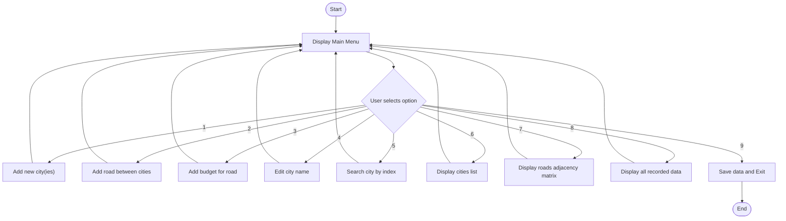

# NE DSA Practical Flow Chart

```mermaid
flowchart TD
    Start([Start])
    Menu["Display Main Menu"]
    Choice{"User selects option"}
    AddCities["Add new city(ies)"]
    AddRoad["Add road between cities"]
    AddBudget["Add budget for road"]
    EditCity["Edit city name"]
    SearchCity["Search city by index"]
    DisplayCities["Display cities list"]
    DisplayRoads["Display roads adjacency matrix"]
    DisplayAll["Display all recorded data"]
    Exit["Save data and Exit"]

    Start --> Menu
    Menu --> Choice
    Choice -->|1| AddCities
    Choice -->|2| AddRoad
    Choice -->|3| AddBudget
    Choice -->|4| EditCity
    Choice -->|5| SearchCity
    Choice -->|6| DisplayCities
    Choice -->|7| DisplayRoads
    Choice -->|8| DisplayAll
    Choice -->|9| Exit
    AddCities --> Menu
    AddRoad --> Menu
    AddBudget --> Menu
    EditCity --> Menu
    SearchCity --> Menu
    DisplayCities --> Menu
    DisplayRoads --> Menu
    DisplayAll --> Menu
    Exit --> End([End])
```
